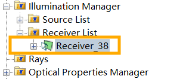
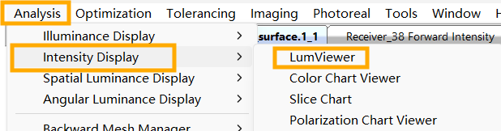
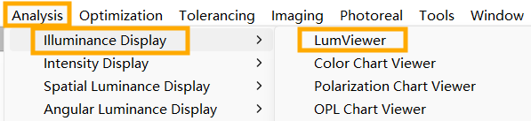
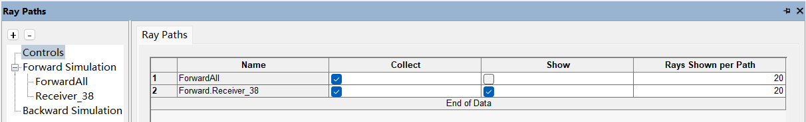
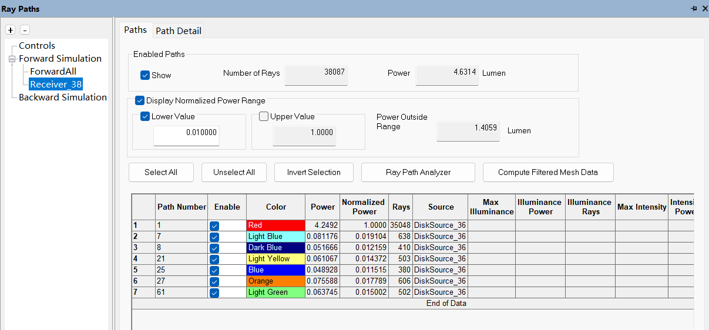
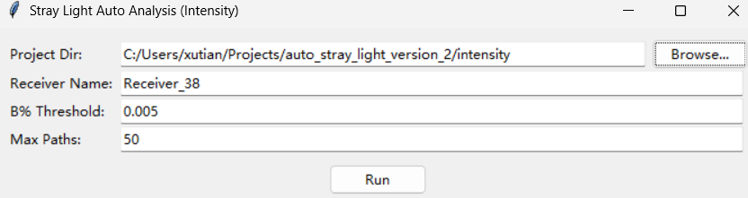
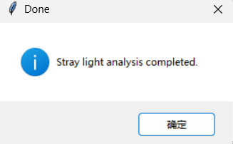
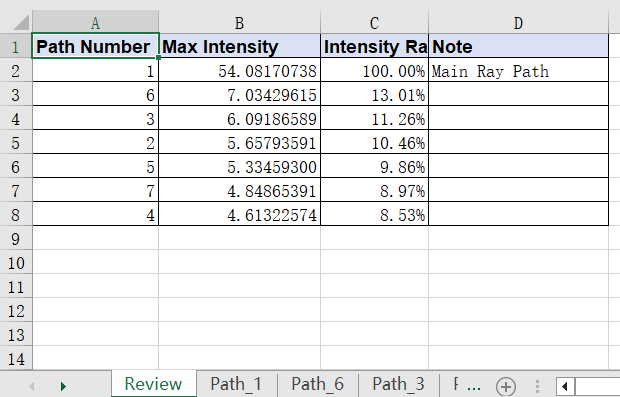
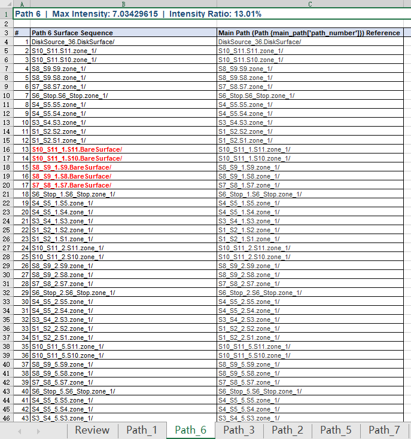
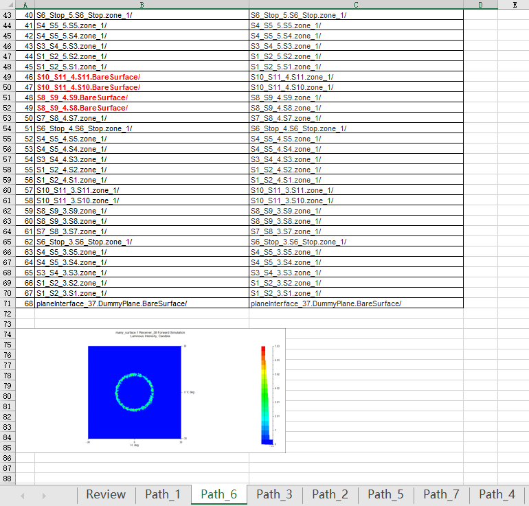

# Lighttools 杂散光自动分析报告工具

在 Lighttools 中筛选杂光写报告感觉特别麻烦，我用 AI 做了一个按照度/强度排序，自动输出杂光报告的程序。

## 适用版本

- Lighttools 2023（其他版本未测试）
- Windows 系统

## 快速使用（无需安装 Python）

1. 下载对应功能的 `.exe` 文件：
   - 照度分析：`illuminance/dist/Stray_Light_Analysis_Illuminance.exe`
   - 强度分析：`intensity/dist/Stray_Light_Analysis_Intensity.exe`
2. 按照下方 [使用步骤](#使用步骤) 操作即可。

---

## 使用步骤

### 准备工作

1. 将 Lighttools 语言切换为 **英文**。
2. 将 Lighttools 文件放在一个 **路径全英文、无空格** 的文件夹中。
3. 打开 Lighttools 文件（一次只能打开一个），只保留 **一个接收器**，并打开强度/照度接收器图像窗口。

   

   

   

### 光线追迹设置

4. 勾选如下选项，然后开始光线追迹：

   

5. 程序会遍历此处所有光线进行排序。跑完光线追迹后，建议使用 **Lower Value** 筛选来控制此页面的光线数量：

   

### 运行程序

6. 双击打开对应的 `.exe` 程序。

   

   

   | 参数 | 说明 |
   |------|------|
   | Project Dir | 选取 Lighttools 文件所在的文件夹 |
   | Receiver Name | 输入 Lighttools 文件中的接收器名称 |
   | B% Threshold | 低于该 Ratio 的杂光不显示在报告中（如输入 `0.005` 表示低于 0.005% Ratio 的杂光不显示），可自行选择阈值 |
   | Max Paths | 报告中输出的光线路径数量 |

7. 点击 **RUN**，程序会自动在 Lighttools 文件所在文件夹生成 `output/` 目录。

   

---

## 报告解读

报告是一份命名为 `stray_light_report_intensity.xlsx` 或 `stray_light_report_illuminance.xlsx` 的 Excel 文件。

| Sheet | 内容 |
|-------|------|
| 第一个 Sheet（总览） | 不同光线路径按杂光 Ratio 排序 |
| 后面每个 Sheet | 每个 Path 的细节，含具体路径和杂光图像 |

筛选逻辑：强度/照度最大的光线路径被认为是主光线路径，**Ratio = 光线 / 主光线**。与主光线路径有区别的地方会以 **红色** 标出。







---

## 源码运行（可选）

如果想从源码运行或二次开发：

```bash
# 安装依赖
pip install -r illuminance/requirements.txt
pip install -r intensity/requirements.txt

# 运行
python illuminance/illuminance_main.py
python intensity/intensity_main.py
```

### 依赖

| 包 | 用途 |
|----|------|
| `pywin32>=312` | Python 控制 LightTools（COM） |
| `openpyxl>=3.1.5` | 生成 Excel 报告 |
| `Pillow>=12.0` | 图片处理 |

---

## 文件结构

```
├── docs/
│   └── images/                   # 使用步骤截图
├── illuminance/                  # 照度分析
│   ├── illuminance_main.py       # 源码
│   ├── many_surface.1.lts        # 示例模型
│   ├── requirements.txt
│   └── dist/
│       └── Stray_Light_Analysis_Illuminance.exe
├── intensity/                    # 强度分析
│   ├── intensity_main.py         # 源码
│   ├── many_surface.1.lts        # 示例模型
│   ├── requirements.txt
│   └── dist/
│       └── Stray_Light_Analysis_Intensity.exe
```

## License

MIT
